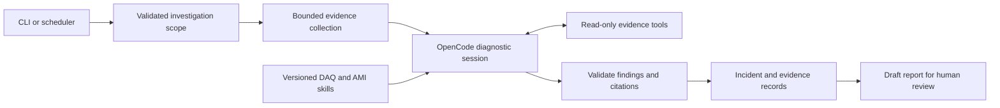

# Software architecture

## Purpose and current implementation

Support hutch robustness monitors by collecting DAQ/AMI evidence, investigating
recurring problems, and producing reviewable findings. TMO is the first hutch.
The same investigation should eventually be callable from a scheduled report,
an operator conversation, or a live incident trigger.

The implementation validates configuration/time windows and can analyze explicitly
supplied log excerpts through OpenCode. It snapshots bounded inputs, loads a local
skill, validates returned citation locations, and writes a draft report. There is
no automatic historical collection, Grafana integration, incident database, or
continuous service yet. See [the runnable workflow](workflows/log-analysis.md).

## Proposed flow

The application owns orchestration, scope, tool access, limits, persistence, and
output validation. OpenCode owns the model/tool conversation loop. Skills provide
diagnostic instructions; they neither grant credentials nor enforce permissions.
An available skill is not evidence that its tools are installed or reachable.

## Repository organization

| Location | Responsibility |
| --- | --- |
| `src/daq_agent/cli.py` | Configuration, planning, and log-analysis commands |
| `src/daq_agent/config.py` | Validate non-secret configuration |
| `src/daq_agent/workflow.py` | Explicit time-window planning; future workflow coordination |
| `src/daq_agent/log_analysis.py` | Compose snapshot collection, skill, model run, and outputs |
| `src/daq_agent/collectors/logs.py` | Bounded copies of explicitly supplied log excerpts |
| `src/daq_agent/runtime.py` | Restricted OpenCode session and bounded subprocess lifecycle |
| `src/daq_agent/reports.py` | Findings schema/citation-location validation and Markdown rendering |
| `src/daq_agent/html_reports.py` | Portable HTML reports and line-numbered evidence pages |
| `src/daq_agent/viewer.py` | Completed-report selection, personal settings, and token-protected loopback viewer |
| `src/daq_agent/skills/` | Application-owned reporting instructions |
| `config/hutches/` | Non-secret hutch examples |
| `tests/` | Deterministic software tests |
| `evals/` | Reviewed diagnostic cases and evaluation criteria |
| `docs/` | Architecture, proposals, plans, and decisions |
| `deploy/` | Deployment contracts and future service templates |

Future additions include `tools/` for service access, `investigations/` for shared
diagnostic workflows, `incidents.py` for persistent incident records, and
`triggers/` for live events. These remain planned boundaries.

## Evidence and incident identity

An investigation carries hutch, partition, start/end UTC instants, display
timezone, launch/session identity where known, and deployed DAQ release where
known. The report interval is always `[start, end)`. Keep missing identity fields
explicit; do not invent values from a current configuration or the latest launch.

Evidence records should retain source identity, log path and line ranges or metric
query and window, collection time, event time where known, coverage/truncation,
and a retained excerpt or artifact reference with an integrity hash. A hyperlink
alone may stop working after source retention expires.

An incident record should contain a stable identifier, an explainable grouping
rule, affected sessions/components, occurrences, impact measurements, evidence
references, observations, hypotheses, next checks, and review status. Raw error
line counts and incident counts must remain distinct. Correlation does not prove
causation. An inference must not silently become a confirmed cause in later runs.

Each report should record the application revision, model identifier/settings,
OpenCode version, skill revisions/hashes, evidence snapshot references, and scope.
This supports audit and comparison; it does not promise identical model wording.

## Deterministic code and model responsibilities

Code handles collection bounds, numeric calculations, input/output validation,
permissions, persistence, and scheduling. The model selects diagnostic checks,
interprets patterns, and explains uncertainty using returned evidence. Enforce
budgets, timeouts, and output schemas in the application/runtime.

Keep the deployed diagnostic service independent of acquisition processes. An AI
gateway outage, slow response, or agent crash must not block DAQ. Hard real-time
timing and protective responses remain in existing DAQ software/hardware.

## Ownership boundaries

DAQ-specific interfaces and diagnostic knowledge remain in `lcls2`; AMI-specific
interfaces and diagnostic knowledge remain in `ami`. This repository owns the
cross-system workflow, incident history, reporting, and service integration.
The MEB/shared-memory delivery boundary is relevant when distinguishing missing
monitoring input from slow AMI processing.

Future operations that change DAQ state require separate tools with validated
arguments, preconditions, scoped authorization, concurrency protection, and
post-action checks. They are outside the reporting MVP.
