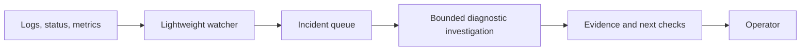

# Proposal 002: Live DAQ troubleshooting

Status: future proposal; not implemented.
Date: 2026-09-21.

## Objective

Run a separate supervised diagnostic service alongside DAQ, reusing historical
reporting tools and skills. Investigations operate over seconds to minutes; they
do not participate in per-event processing or hard real-time control.

## Trigger and lifecycle design

- Use deterministic polling/subscriptions to detect failed transitions, process
  exits, or sustained anomalies. A model need not run continuously.
- Debounce duplicate triggers, capture before/after evidence, and correlate by
  hutch/partition/launch. Restarts must create a new session identity.
- Persist queue/checkpoint state. Coalesce updates to an active incident rather
  than creating a new investigation for every repeated message.
- Bound worker concurrency, collection volume, query frequency, model cost, and
  total investigation time. Define cancellation and retry limits.
- Record watcher/evidence-source outages separately from DAQ health. A restart
  should resume safely without losing incident identity or repeating notices.
- Notify on a meaningful new incident, changed assessment, or required operator
  action. Do not send unchanged periodic status by default.

## Isolation

DAQ continues if the watcher, agent, database, network, or AI service fails.
Run on an approved host with observability access, with resource limits and a
read-only identity. Avoid running model work on detector/event-processing nodes.

## Future operational actions

Startup checks can remain read-only. Launching DAQ processes, configuring a
partition, and beginning recorded acquisition are distinct operations. Any future
mutating tool needs a separate design, explicit scope/authorization, current-state
validation, locking against concurrent operators, bounded execution, and result
verification. Diagnosis alone does not authorize automatic remediation.
