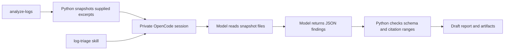

# Runnable workflow: analyze supplied DAQ logs

Status: implemented prototype. This is an application workflow, with a separate
credential-free CI test. It can launch real OpenCode and produce model findings;
it does not yet discover logs on DAQ hosts or query Grafana.

## The pieces added to the repository

| Piece | File | Responsibility |
| --- | --- | --- |
| Command | `src/daq_agent/cli.py` | Parse `analyze-logs` arguments |
| Python workflow | `src/daq_agent/log_analysis.py` | Coordinate inputs, skill, runtime, and outputs |
| Collector | `src/daq_agent/collectors/logs.py` | Copy bounded log excerpts and record hashes/line counts |
| Runtime adapter | `src/daq_agent/runtime.py` | Launch restricted OpenCode and handle timeout/failure |
| Skill | `src/daq_agent/skills/log-triage/SKILL.md` | Explain how to interpret evidence and qualify conclusions |
| Report code | `src/daq_agent/reports.py` | Validate JSON/citation locations and render Markdown |
| Example script | `examples/log-analysis/run.sh` | Supply the synthetic case's paths and time window |
| Evaluation fixture | `evals/cases/configure-permission/` | Two small synthetic logs |
| Review rubric | `evals/expected/configure-permission.json` | Expected observations and unsupported claims |
| Tests | `tests/test_log_analysis.py` | Exercise orchestration with a fake subprocess, without API access |

The example script is convenience only. Python owns execution and validation;
the Markdown skill guides the model's interpretation. A new workflow does not
need a new shell script unless it makes a concrete example easier to run.



## Run the synthetic example

From the checkout, activate a Python 3.11+ virtual environment and install the
current package (`python -m pip install -e .`). An existing wheel installation
must be updated after source changes.

Prepare without OpenCode or credentials:

```bash
bash examples/log-analysis/run.sh --local-skills-only --prepare-only
```

Synchronize the pinned DAQ skills once, then run with the LCLS shared provider
definition on SDF:

```bash
daq-agent sync-skills --config config/hutches/tmo.toml
```

```bash
bash examples/log-analysis/run.sh
```

The sample TMO configuration supplies these non-secret defaults:

```toml
provider_config = "/sdf/group/lcls/ds/dm/apps/dev/opencode/opencode.json"
opencode = "/sdf/group/lcls/ds/dm/apps/dev/code/.opencode/bin/opencode"
output_root = "~/daq/agent-logs"
```

CLI `--provider-config` and `--opencode` take precedence over configuration.
Older configurations without these fields still use `opencode` from PATH and
require an explicit provider config for model execution.

Without `--output`, each invocation creates a private run directory under
`$HOME/daq/agent-logs/<hutch>/YYYY/MM/`, for example
`tmo/2026/09/21T093000-tmo-p0-<unique-id>/`. The hutch comes from the selected
configuration. The year/month reflect the launch date in
the configured timezone, not the historical evidence window. `~` expands to the
invoking user's home; change `output_root` to relocate this tree. Missing parent
directories are created. The CLI prints the full resulting path. `--output`
overrides this with an exact path, which must be new.

`--model provider/model` overrides the
hutch default, but that exact model must exist in the supplied provider config.
`--timeout` defaults to 180 seconds and may be set to at most 600. A real run uses
the model API; the regular CI workflow never does.

## Supply your own excerpts

```bash
daq-agent analyze-logs --config config/hutches/tmo.toml \
  --from 2026-09-18T10:00:00-07:00 --to 2026-09-18T10:05:00-07:00 \
  --log /path/to/control-excerpt.log --log /path/to/teb-excerpt.log \
  --provider-config /path/to/opencode-provider.json \
  --output /path/to/new-private-result
```

Use the configured provider only for logs permitted for that service. Input files
are copied into private artifacts and their contents are sent to the selected
model. Supply already scoped excerpts: there is no automatic time filtering,
log discovery, SSH collection, secret redaction, or complete-session coverage.
The model is instructed to distinguish contextual lines outside the window.
That attribution still requires human review. `--synthetic` is an explicit label,
not automatic detection; omit it for real excerpts.

Limits: 1–8 regular UTF-8 files, at most 64 KiB each and 256 KiB total. Oversized
inputs fail rather than silently dropping evidence. Source files are never edited.

## Skills and access

The runtime copies the packaged `log-triage` skill and the snapshots into a fresh
temporary workspace. It imports only the selected provider/model, accepting an
API-key reference (`{file:/absolute/path}` or `{env:VARIABLE}`) rather than a
literal secret. It supports JSON provider configuration using the Anthropic,
OpenAI, or OpenAI-compatible adapters and an HTTPS endpoint.

It disables project/Claude/external skill discovery, default plugins, and inherited
OpenCode environment overrides. Configuration/data/cache/state are isolated under
the temporary workspace; use a node-local temporary directory on SDF. The shared
provider file is not modified and its MCP servers/agents/plugins are not imported.

OpenCode permissions allow `log-triage`, the configured upstream skills,
reads of their references, and reads of snapshot files.
Other tools, including shell, edits, network queries, and delegation, are denied.
This is an application-level permission boundary, not an OS/container sandbox.
OpenCode itself must access its provider and credentials. A production deployment
still needs reviewed host/service isolation. The model can take at most twelve steps with upstream skills (eight in
local-only mode); process time and retained runtime output are bounded separately.

The TMO configuration selects the pinned `psana-daq` and `psana-daq-logs`
skills from the upstream PR. See [skill synchronization](../skills-integration.md).
Other diagnostic skills and their service integrations are unavailable.

## Outputs and failure behavior

The newly created output directory has mode 0700; retained files use mode 0600.
It contains:

- `manifest.json`: scope, model, application/runtime version, skill hash, source
  hashes/line counts, evidence label, Grafana status, and execution status.
- `evidence/`: unchanged input snapshots with stable source IDs.
- `skill.md`, `upstream-skills/` (when enabled), and `prompt.txt`: instructions used
  for this analysis, with source provenance and hashes in the manifest.
- `events.jsonl` and `runtime.stderr.log`: private runtime output for diagnosis.
- `response.txt`: the returned model text.
- `findings.json` and `report.md`: emitted after schema/citation checks pass.
- `report.html` and `logs/log-N.html`: portable formatted report and linked log views.

Use `daq-agent view` to browse the latest completed report, or supply this run
directory explicitly. See [viewing reports](../viewing-reports.md) for SSH and
NoMachine instructions. Viewing older runs does not modify their artifacts.

Preparation writes the inputs and manifest but produces no findings. A failed or
timed-out run exits nonzero and records `failed`; it does not write a success
report. Existing output directories are never overwritten. Treat runtime artifacts
from real logs as operational data and keep them outside public commits.

Citation validation proves that a source ID and line range exist. It does not
prove that those lines support the conclusion. Review the report against the
evidence and the synthetic case's rubric. Grafana is always explicitly marked
not queried in this workflow; no missing metrics are fabricated.

The runtime trace must also show completed loads of `log-triage` and every selected
upstream skill, and a
successful read call for each snapshot. Unexpected completed tool calls invalidate
the result. This checks actual tool use; it does not establish full semantic
coverage of each file or replace the runtime's permission enforcement.

## Initial integration observation

On 2026-09-21, the synthetic example completed through the configured SLAC Sonnet 5
provider using OpenCode 1.2.10. The runtime trace showed a skill load and both
snapshot reads. The report identified the Configure failure and the participant's
queue permission error, cited valid lines, marked Grafana unavailable, and did not
claim stale resources or a confirmed root cause. This verifies one small
integration case, not production diagnostic quality or all model/provider versions.

## How to add the next workflow

1. Define one task, its evidence inputs, and a structured output contract.
2. Reuse existing collectors/runtime where possible; add Python code for new
   access, calculations, limits, and persistence.
3. Add or reuse a skill for the domain interpretation. Pin external skills rather
   than copying an untracked branch tip.
4. Add a small synthetic case and semantic review expectations.
5. Test orchestration and failure behavior without credentials in CI, then run an
   explicit integration check in the environment that has service access.
6. Document actual capabilities, missing sources, and the invocation under `docs/`.

Grafana can later become an optional evidence provider with its own access
preflight. It is not a prerequisite for demonstrating the log-analysis workflow.
